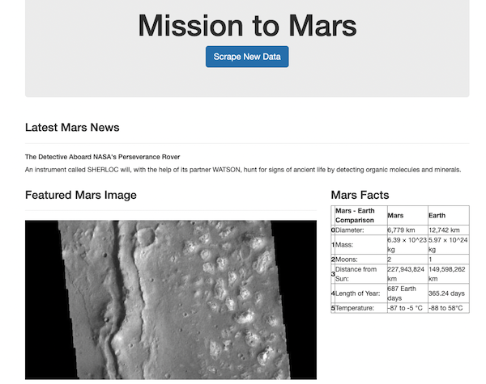
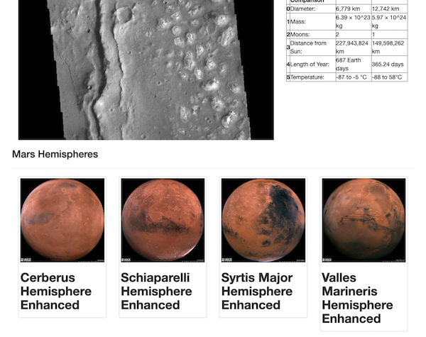

# web-scraping-challenge

In this assignment, I built a web application that scrapes various websites for data related to Mars and displays the information in a single HTML page. 

The final application scrapes and displays the following:

* NASA Mars News: News Title and Paragraph Text
* JPL Mars Space Images: Featured Image
* Mars Facts: pandas Data Frame containing facts about the planet including diameter, mass, etc.
* MArs Hemispheres: High-resolution images for each hemisphere of Mars.

Below are screenshots of the page:

------------------------------------

